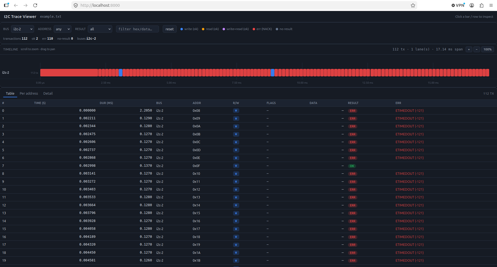

# i2c_tracer

Parse an **I2C ftrace log** and visualize the communication in a **local web GUI**.

It reads a Linux `ftrace` (nop tracer) log containing `i2c_write`, `i2c_read`,
and `i2c_result` events, groups the raw events into complete transactions, and
serves an interactive dark-themed dashboard: a zoomable/pannable timeline, a
transaction table, a per-address view, and a per-transaction detail pane — all
with live filtering.

No third-party packages are required — it runs on the **Python 3 standard
library only**.

<p align="center">
  
</p>

This software has been vibe coded has not been thoroughly tested. Use on your own risk.

---

## Features

- **Timeline** — one lane per I2C bus, one bar per transaction, color-coded
  by outcome. Scroll to zoom (anchored at the cursor), drag to pan, or use the
  `+` / `–` / `100%` controls. Adapts the time scale from the full span down to
  the microsecond range; time gaps between sessions are marked instead of
  stretched.
- **Transaction table** — `#`, `time (s)`, `dur (ms)`, `bus`, `addr`, `R/W`
  (W / R / W+R badge), decoded `flags` (e.g. `RD`, `TEN`), write `data`
  (hex), `result` badge, and the `err` name (e.g. `ETIMEDOUT`).
- **Per-address view** — one row per bus + address with ok/err counts; click a
  row to filter to that address.
- **Detail pane** — every segment of a transaction with the exact byte hex,
  direction (master ↔ device), flags, byte counts, and pid/task/cpu.
- **Filters** — by bus, by address, by result (ok / err / pending), and
  free-text search (bus, address, data, task); reset button restores all.

---

## Install

The only requirement is **Python 3** (3.8+; tested on 3.12). There is nothing
else to install — no `pip install`.

On Ubuntu:

```bash
sudo apt update
sudo apt install python3
```

That's it. `index.html` (the GUI) and `example.txt` (a sample log) are included
with the project.

---

## Usage

First activate tracing with 
```bash
echo nop > /sys/kernel/debug/tracing/current_tracer
echo 1 > /sys/kernel/debug/tracing/events/i2c/enable
echo 1 > /sys/kernel/debug/tracing/tracing_on
```
This will generate the file /sys/kernel/debug/tracing/trace which will contain all data in a not so well readable format.
The file might require sudo rights to open. You can either run the script with sudo or change the rights with the chmod command.

The script usage is the following.
```bash
python3 i2c_tracer.py <LOG_FILE> [OPTIONS]
```

### Arguments

| Argument   | Description                                  |
| ---------- | -------------------------------------------- |
| `LOG_FILE` | Path to the I2C ftrace log file (e.g. `example.txt`). |

### Options

| Option            | Description                                                            |
| ----------------- | ---------------------------------------------------------------------- |
| `-p, --port N`    | HTTP port for the GUI (default: `8000`).                                |
| `--no-browser`    | Do not automatically open a web browser (just start the server).        |

### Examples

```bash
# Serve the bundled example and open the GUI in your browser
python3 i2c_tracer.py example.txt

# Use a custom port
python3 i2c_tracer.py example.txt -p 8080

# On a remote/headless machine: start without the browser, then open
# http://localhost:8000/ in your browser (after port-forwarding)
python3 i2c_tracer.py example.txt --no-browser -p 8000
```

The server listens on `http://localhost:PORT/`. Stop it with **Ctrl+C**.

### API endpoints

| Path      | Returns                          |
| --------- | -------------------------------- |
| `/`       | The GUI (HTML).                  |
| `/trace`  | The parsed data as JSON (`{summary, txns, source}`). |

You can point the app at any other I2C ftrace log by passing a different file —
no code changes needed.

---

## Input log format

The parser expects `ftrace` lines of this shape:

```
task-pid [cpu] <flags>  SEC.USSEC: EVENT: args
```

Recognized events:

```
i2c_write:  i2c-2 #0 a=008 f=0000 l=0        []
i2c_write:  i2c-1 #0 a=000 f=0200 l=2      [80-80]
i2c_read:   i2c-1 #0 a=000 f=0201 l=1
i2c_result: i2c-2 n=1 ret=-121
```

- `a=` slave address (hex), `f=` message flags, `l=` byte length.
- `i2c_result` `ret`: a positive value means ACK/success; a negative value is
  the errno (e.g. `-121` → `ETIMEDOUT`).
- Adjacent `i2c_write`/`i2c_read` events for the same bus are grouped into one
  transaction and closed by the following `i2c_result`.

> Note: in this ftrace format `i2c_read` lines carry only the requested byte
> **count** (`l=N`), not the returned byte values — the GUI labels those as
> “N B read · bytes not in log”. Write bytes (when present) are shown in full.

### The `f=` flags field

`f=` is the **I2C message-flags** word (bitmask) passed to the kernel in the
`struct i2c_msg`. Each bit sets an attribute of that message. The GUI decodes
the bits into short names — shown in the table’s **flags** column (e.g. `RD`,
`TEN`) — and in the detail pane with the raw hex (e.g. `RD|TEN · 0x0201`):

| Name         | Bit     | Value | Meaning                                                                 |
| ------------ | ------- | ----- | ----------------------------------------------------------------------- |
| `RD`         | `bit 0` | `0x1` | **Read** message — data flows device → master. Writes carry this bit clear. |
| `TEN`        | `bit 9` | `0x200` | **10-bit / extended addressing** — the 7-bit slave address is extended (used for 10-bit or 64-bit addressing). |
| `RECV_LEN`   | `bit 10` | `0x400` | Request the **receive length** from the adapter (mux-aware length query). |
| `NO_RD_ACK`  | `bit 11` | `0x800` | For a read, **do not send the final NACK** / skip the terminating not-ACK. |
| `PROC_CALL`  | `bit 12` | `0x1000` | The message is a **generic mailbox / process call** rather than a normal data transfer. |
| `RESTART_NO_RD` | `bit 13` | `0x2000` | Issue a **repeated-START** to switch to read without an explicit read address first. |

Notes:

- Multiple bits can be set at once; the GUI lists them with `|`
  (e.g. `RD|TEN` = a 10-bit-addressing read).
- A value of `0x0000` (shown as `—` in the table) means a **plain write** with
  no special flags.
- Bits not listed in the table are rendered as their raw `0x…` hex value.

In the bundled `example.txt` only four values appear: `0x0000` (plain write),
`0x0001` (`RD`), `0x0200` (`TEN`), and `0x0201` (`RD|TEN`).

---

## Requirements

- Python 3.8+ (standard library only: `http.server`, `json`, `argparse`, ...)
- Any modern web browser to view the GUI.
